# AsterOS Enterprise

AsterOS is an enterprise-grade operating system built on the Debian ecosystem, designed for secure, stable, and scalable computing across data centers, workstations, edge devices, and cloud environments.

Developed by Asterion Systems, AsterOS combines the reliability of Debian with hardened system components, enterprise lifecycle management, and an optimized kernel stack tailored for modern infrastructure.

## Business Premise and Objective AsterOS was conceived as a premium operating 

platform for organizations that demand more than functionality: they demand visual beauty, speed, stability, and operational efficiency. Our premise is that a modern operating system must be both elegant and highly optimized, creating a professional experience for users, administrators, and infrastructure teams. The project's primary goal is to deliver a lightweight, performant, and visually refined technology base capable of supporting enterprise environments, workstations, servers, and critical infrastructure with high productivity and low operational costs. AsterOS seeks to combine the reliability of the Debian ecosystem with a modern, secure, lean architecture prepared for a future of enterprise scalability. Our vision is to transform the user experience into a more fluid, productive, and reliable journey, with clean interfaces, an efficient boot process, rational use of resources, and a technical foundation that reflects the company's culture of excellence.

---

## 1. Overview

AsterOS is not a generic Linux distribution. It is a production platform engineered for organizations that require:

- Long-term stability
- Security-first design
- Predictable updates
- Enterprise supportability
- Compatibility with Debian package ecosystems
- Deployment flexibility from bare metal to cloud

The project is built around a Debian-based base system, extended with a hardened kernel, custom tooling, security policies, and operational automation designed for real enterprise workloads.

---

## 2. Company Vision

Asterion Systems exists to simplify enterprise computing by delivering a dependable operating system platform with transparent governance and a strong security model.

Our mission is to provide organizations with a platform that can operate in:

- Critical infrastructure environments
- Developer workstations
- Application servers
- Virtualized workloads
- Secure remote edge deployments

We believe an operating system should be a strategic enterprise asset: stable, manageable, auditable, and ready for scale.

---

## 3. Product Principles

### Security by default
AsterOS is built with security controls enabled from the first boot. This includes:

- Mandatory kernel hardening
- Secure boot support
- Firewall defaults
- AppArmor and SELinux-ready policies
- Signed package verification
- Centralized security auditing

### Stability and compatibility
AsterOS is designed around Debian package compatibility and long-term maintenance, enabling:

- Predictable release cycles
- Backward-compatible system components
- Broad software availability
- Minimal disruption during upgrades

### Enterprise operations
Operational features are essential to the platform, including:

- Remote deployment tools
- Configuration management integration
- Monitoring hooks
- Centralized logging
- Recovery and rollback workflows

---

## 4. Architecture

AsterOS uses a layered architecture composed of a Debian-derived userland and a custom enterprise kernel profile.

### Core layers

1. Kernel layer
   - Debian-compatible Linux kernel
   - Hardened kernel configuration
   - Security patches and performance tunables
   - Device support for enterprise hardware and cloud instances

2. System layer
   - Init system and service orchestration
   - Systemd-based boot and process management
   - Standard Debian tools and libraries
   - Unified configuration model

3. Security layer
   - Signed repositories
   - Access control policies
   - Audit logging
   - Disk encryption support
   - Container isolation support

4. Management layer
   - Package management
   - Remote configuration
   - Deployment automation
   - Hardware inventory and health reporting

5. Applications and workloads
   - Enterprise web services
   - Databases
   - Development tools
   - Container runtimes
   - Network infrastructure services

---

## 5. Kernel Strategy

The AsterOS kernel is a Debian-aligned Linux kernel optimized for enterprise conditions.

### Kernel characteristics

- Debian package compatibility
- Long-term supported kernel branches
- Performance tuning for server workloads
- Security hardening for multi-tenant and regulated environments
- Modular device support for modern x86_64 and ARM platforms

### Kernel goals

- Maximize stability under continuous operation
- Reduce attack surface through security hardening
- Preserve compatibility with the Debian ecosystem
- Support virtualization, storage, network acceleration, and container workloads

---

## 6. Userspace and Debian Compatibility

AsterOS is based on Debian principles but is enhanced to meet enterprise requirements.

### Included components

- Debian package repositories
- APT-based software management
- Systemd service model
- Standard GNU/Linux userland tools
- Enterprise security and observability packages

### Why Debian-based

Using Debian as the foundation gives AsterOS several advantages:

- Mature package ecosystem
- Strong community and stability
- Broad hardware compatibility
- Predictable maintenance model
- Effective long-term support strategy

---

## 7. Package Management

AsterOS uses APT as the primary package management system, with enterprise policy controls layered on top.

### Package model

- Official Debian repository compatibility
- Custom AsterOS repository
- Signed packages for trusted installation
- Controlled update windows
- Rollback support for critical services

### Example operations

```bash
apt update
apt upgrade
apt install asteros-agent
apt install nginx mysql-server
```

### Repository strategy

AsterOS maintains three layers of repositories:

- Base Debian repositories
- AsterOS certified repository
- Security and hotfix repository

This separation allows organizations to maintain stability while rapidly applying trusted fixes.

---

## 8. Security Model

Security is one of the main pillars of the AsterOS platform.

### Security features

- Secure boot support
- Verified package signatures
- Encrypted storage support
- Minimal attack surface by default
- Hardened system services
- Audit-friendly configuration model
- Network segmentation support

### Security policies

The platform follows a zero-trust-inspired operational model:

- Least privilege access
- Explicit service authorization
- Integrity validation during updates
- Centralized logging and alerts
- Controlled privilege boundaries for administrators

---

## 9. Deployment Models

AsterOS is designed for multiple delivery models.

### Server deployment
Optimized for:

- Web hosting
- Database services
- Identity services
- Messaging and integration layers
- AI and compute orchestration

### Workstation deployment
Optimized for:

- Enterprise desktops
- Developer environments
- Design and engineering workstations
- Hybrid office and remote productivity

### Edge deployment
Optimized for:

- IoT gateways
- Remote industrial systems
- Branch offices
- Field infrastructure

---

## 10. Lifecycle and Support

AsterOS follows a structured lifecycle model to support enterprise environments.

### Release model

- Long-Term Support (LTS) releases
- Stable release channels
- Security update channel
- Preview channel for early validation

### Support commitments

- Security patch support window
- Update advisories and release notes
- Compatibility validation for supported hardware
- Escalation routes for critical incidents

---

## 11. System Administration

AsterOS includes a complete administrative model for enterprise operators.

### System management features

- Service orchestration via systemd
- Scripted provisioning
- Idempotent configuration
- Remote diagnostics
- Backup and restore automation

### Example system check

```bash
systemctl status asteros-agent
journalctl -xe
uname -a
```

---

## 12. Roadmap

The project roadmap is documented in Mermaid format for easier viewing and version control.

- [Project roadmap](docs/roadmap.md)
- 

## 13. Reliability and Performance

AsterOS is engineered for operational reliability in production environments.

### Key performance areas

- Efficient process scheduling
- Optimized I/O behavior
- Resource accounting for services
- Multi-core scalability
- Storage and network performance tuning

### Memory cache and process scheduling

AsterOS adopts a resource-efficient execution model designed to reduce unnecessary RAM allocation and improve system responsiveness under sustained workloads.

#### Cache strategy

The kernel and userspace stack implement a layered cache strategy to minimize repeated disk and memory access:

- Page cache for frequently accessed file and block data
- CPU cache hierarchy to reduce latency and improve locality of reference
- Kernel object caching to avoid repeated memory allocation for common structures
- I/O buffering to smooth bursts in workload demand

This model reduces pressure on memory, lowers page faults, and improves the behavior of database, web, and application workloads during high concurrency.

#### Process scheduling model

The AsterOS process scheduler is built to balance fairness, responsiveness, and throughput. It prioritizes:

- Interactive user workloads
- Real-time and latency-sensitive services
- High-throughput batch and compute tasks
- I/O-bound operations with efficient wake-up behavior

The scheduler uses time slicing, priority classes, and workload-aware heuristics to prevent starvation while preserving predictable latency for critical services.

#### Kernel and VFS overview

At a system level, the kernel is responsible for process management, memory management, device handling, and security enforcement. The Virtual File System (VFS) layer provides a single abstract interface so that applications can access files regardless of the underlying storage technology.

In practical terms:

- The kernel manages processes and their memory spaces
- The VFS standardizes file access across local disks, network shares, and virtual mounts
- Filesystems such as ext4, XFS, and overlayfs are implemented beneath the VFS abstraction
- Applications interact with a consistent API while the storage backend remains transparent

This architecture is critical for enterprise reliability because it allows secure, portable, and maintainable software stacks without coupling user space programs to a single filesystem implementation.

#### Example: kernel and VFS model in English

> The kernel is the central execution layer of the operating system. It schedules tasks, manages memory, enforces permissions, handles interrupts, and coordinates access to hardware. The VFS sits above the concrete filesystem drivers and presents a unified interface to user-space applications, allowing them to read, write, and manage files without caring whether the actual storage backend is local, remote, or virtualized.

---

## 13. Compliance and Auditing

AsterOS is designed to support regulated environments and compliance-driven organizations.

### Enterprise capabilities

- Audit log retention
- File integrity monitoring
- Access traceability
- Security configuration baselines
- Compliance-ready reporting templates

This makes AsterOS suitable for sectors such as:

- Finance
- Healthcare
- Government
- Telecommunications
- Logistics and manufacturing

---

## 14. Developer Experience

Developer productivity is a strategic concern for AsterOS.

### Included tools

- Modern compilers and toolchains
- Build and packaging utilities
- Version control support
- Virtualization and container tooling
- Integrated productivity environment for enterprise teams

### Target workflows

- Application build pipelines
- CI/CD execution
- Containerized deployments
- Microservice orchestration
- Remote engineering operations

---

## 15. Roadmap

### Current focus

- Hardened kernel baseline
- Enterprise package repository stabilization
- Improved remote management tooling
- Better automation for provisioning and patching

### Upcoming milestones

- Full release automation pipeline
- Expanded edge deployment support
- Advanced compliance policy templates
- Improved hardware and cloud compatibility testing
- Enhanced telemetry and diagnostics

---

## 16. Recommended Use Cases

AsterOS is recommended for organizations that need a dependable operating system with enterprise-grade governance, including:

- Private data centers
- Managed hosting environments
- Secure office infrastructure
- Research and development platforms
- Cloud-native deployment bases

---

## 17. Conclusion

AsterOS represents the next step in enterprise Linux design: a Debian-based operating system shaped for reliability, security, and scale.

By combining Debian stability with enterprise hardening, lifecycle management, and operational automation, AsterOS provides organizations with a modern foundation for critical infrastructure, secure productivity, and long-term technical continuity.

---

## 18. Contact and Product Information

Asterion Systems
- Website: https://www.asterionsystems.example
- Support: support@asterionsystems.example
- Engineering: engineering@asterionsystems.example

This document is intended as a high-level product specification and operational architecture overview for the AsterOS platform.git 