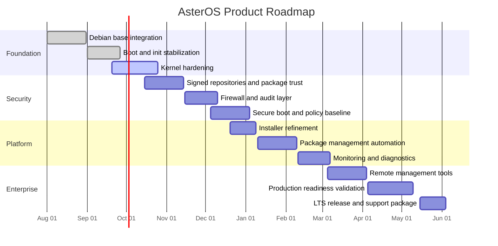

# AsterOS Roadmap

This roadmap presents the main milestones for the project, from the base system foundation to enterprise-ready delivery.

## Roadmap phases

### Phase 1: Foundation
- Stable Debian-compatible boot and init system
- Hardened kernel configuration
- Core documentation and architecture baseline

### Phase 2: Security and reliability
- Signed packages and controlled repositories
- Firewall, audit and access policy controls
- Secure update and recovery workflows

### Phase 3: Platform maturity
- Improved installer experience
- Packaging automation and lifecycle management
- Monitoring and operational observability

### Phase 4: Enterprise release
- Remote management tooling
- Production validation and support readiness
- Long-term support release

## Notes

This roadmap is intended to evolve with the project. It supports planning, execution tracking, and communication with stakeholders, clients, and technical teams.
